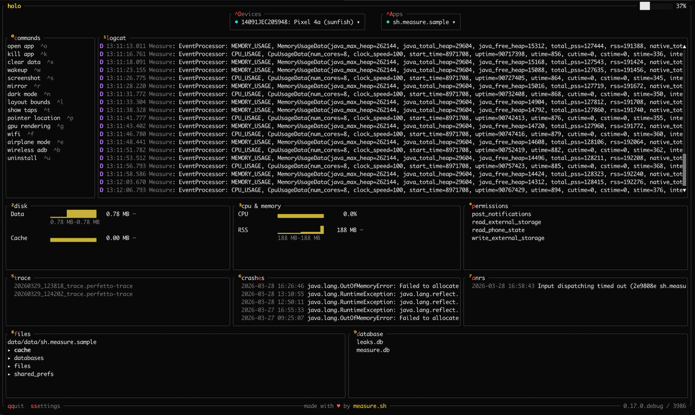
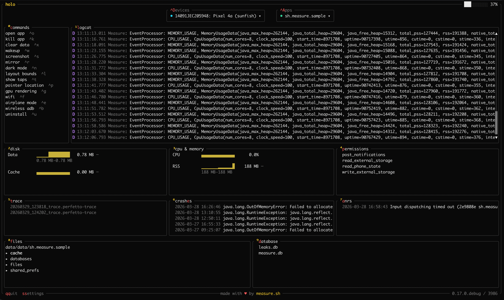
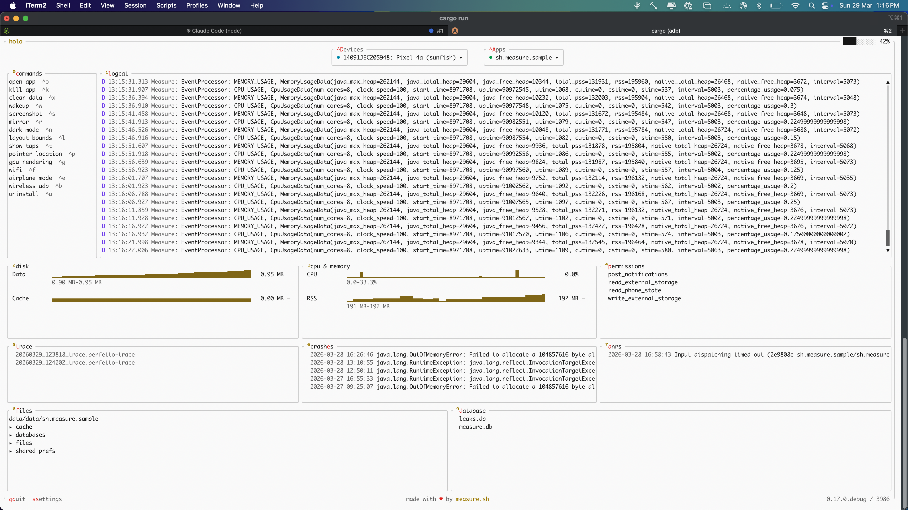
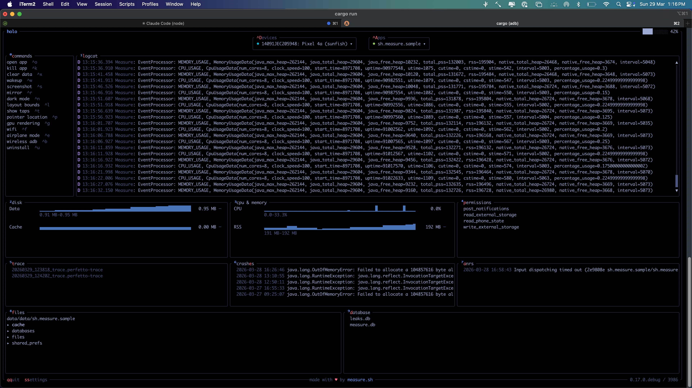
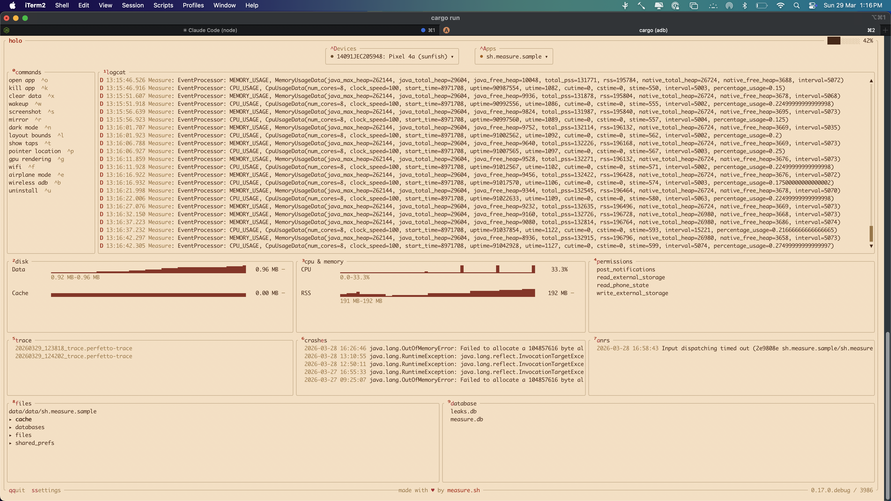

# Holo

[](https://github.com/measure-sh/holo/actions/workflows/ci.yml)
[](https://github.com/measure-sh/holo/releases/latest)


A terminal UI for Android. Built for developers who don't like leaving the terminal.
Manage app data, browse logs, record traces, run database queries, and control your device
settings directly from the TUI with simple commands.

**Built by the team behind [Measure](https://github.com/measure-sh/measure).**



## Setup

### Prerequisites

- [adb](https://developer.android.com/tools/adb) must be in your `PATH`
- `$EDITOR` or `$VISUAL` set to your preferred editor (used to open files and logs)
- [scrcpy](https://github.com/Genymobile/scrcpy) (optional, required for device mirroring)

### Install

**macOS / Linux**

```sh
curl -sSL https://raw.githubusercontent.com/measure-sh/holo/main/install.sh | sh
```

**Windows**

Download the latest `holo-x86_64-pc-windows-msvc.zip` from the
[Releases page](https://github.com/measure-sh/holo/releases/latest), extract
`holo.exe`, and place it somewhere on your `PATH`.

**From source (any platform with Rust)**

```sh
cargo install holo
```

## Usage

```sh
$ holo
```

## Features

- **Logcat** — filter by tag, search text, or log level. Scroll back through history or tail live.
- **SQLite databases** — open any app database and run SQL queries right in the TUI. Browse results or pull the whole db to your machine.
- **Memory and CPU stats** — live CPU, memory, and disk usage with sparkline graphs. Spot leaks at a glance.
- **Perfetto traces** — start and stop system traces from the TUI. Open them in ui.perfetto.dev with one keystroke.
- **File browser** — navigate your app's data directory as a tree. Pull any file to your machine with a single key.
- **Crashes and ANRs** — see crash stack traces and ANR reasons as they happen.
- **Permission management** — grant and revoke runtime permissions.
- **Quick commands** — open, kill, uninstall, screenshot, toggle dark mode, layout bounds, show taps, and more.
- **Device mirroring** via scrcpy.
- **Wireless ADB** setup.
- **Keyboard-driven** with vim-style navigation.

## Themes

Holo ships with 4 built-in themes. Switch themes from the settings menu.

### Dark


### Light


### Tokyo Night


### Akaito


Tokyo Night and Akaito themes are based on [Omarchy](https://omarchythemes.com) color palettes.

## Credits

- UI heavily inspired by [btop](https://github.com/aristocratos/btop)
